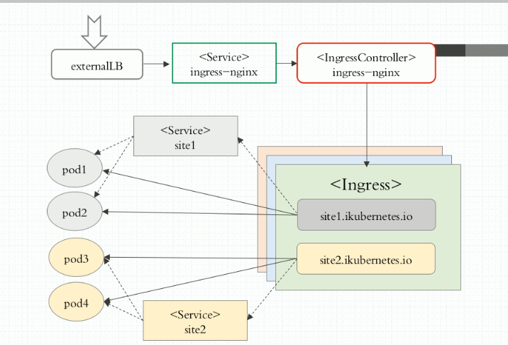

## 关于Service(资源)

- Service-四层调度
  - 工作模型： Userspace Iptables Ipvs三种
  - 五种类型
   1. ClusterIP 只能在集群内部可达，可以被pod和node所访问。无法接入集群外部的流量。
   2. Nodeport

   ```
   访问流程
    Client --> NodeIP:NodePort--> ClusterIP:SvcPort-->PodIP:containerPort
    一般情况会给NodePort进行负载均衡器。
   ```
   3. LoadBalancer
   4. ExternelName
   5. No ClusterIP - Headless Service(无头服务)  `ServiceName-->PodIP`


## 关于Ingress Controller和Ingress

- Ingress Controller通常是有用7层协议代理能力的控制器，自身也是运行与集群中的Pod资源对象。
  - Nginx
  - Traefik
  - Envoy

- Ingress也是标准的kubernetes资源类型之一，它其实就是一组基于DNS名称或URL路径把请求转发至指定的service资源规则，用于将集群外部的请求流量转发至集群内部完成服务发布。

- Ingress 是 Kubernetes 中的一个抽象资源,其功能是通过 Web Server 的 Virtual Host 概念以域名(Domain Name)方式转发到內部 Service,这避免了使用 Service 中的 NodePort 与 LoadBalancer 类型所带來的限制(如 Port 数量上限),而实现 Ingress 功能则是通过 Ingress Controller 来达成,它会负责监听 Kubernetes API 中的 Ingress 与 Service 资源物件,并在发生资源变化时,根据资源预期的结果来设置 Web Server

- Ingress Controller实现的基本逻辑如下：

1. 监听apiserver，获取全部ingress的定义
2. 基于ingress的定义，生成Nginx所需的配置文件(/etc/nginx/nginx.conf)
3. 执行nginx -s reload命令,重新加载nginx.conf配置文件的内容


## 部署

```bash
kubectl create ns ingress-nginx
#这里注意，要修改一下ingress-controller-svc.yml 中的externalIPs的地址。 就是你自定义LB的地址。
kubectl apply -f /srv/addons/nginx-ingress/
```

## 验证

```bash
[root@k8s-master01 nginx-ingress]# kubectl -n ingress-nginx get po,svc
NAME                                            READY   STATUS    RESTARTS   AGE
pod/default-http-backend-774686c976-m929c       1/1     Running   0          6m17s
pod/nginx-ingress-controller-7fc9fc4457-9cvdd   1/1     Running   0          6m17s
pod/nginx-ingress-controller-7fc9fc4457-gf76d   1/1     Running   0          6m17s

NAME                           TYPE        CLUSTER-IP      EXTERNAL-IP   PORT(S)   AGE
service/default-http-backend   ClusterIP   10.93.113.133   <none>        80/TCP    8m15s

[root@k8s-master01 ~]# curl http://10.93.113.133
default backend - 404

#确认上面步骤都沒问题后,就可以通过 kubeclt 建立简单 Myapp 来测试功能，此处可能需要先配置MetaILB
[root@linux-node1 apps]# kubectl apply -f /srv/apps/myapp-http-svc.yaml
pod/myapp unchanged
service/myapp-service unchanged
ingress.extensions/myapp unchanged
#访问测试
[root@linux-node1 apps]# curl http://192.168.150.252 -H 'Host: myapp.k8s.local'
Hello MyApp | Version: v1 | <a href="hostname.html">Pod Name</a>
```

## 关于Ingress service优化配置

- 由于ingress-controller是集群对外暴露服务的一种方式。这里我们可以将他的cluster IP 设置为10.1.159.254 方便记忆和查找。
- 如果service的externalTrafficPolicy为Local，那么只有service关联的pod所在的节点上才能通过nodeport访问。
-  kubectl uncordon mastername  让master节点也参与调度。
-  yaml文件中通过initContainers的方式优化nginx-ingress内核参数。

## ingress-controller扩展

## `daemonset`和`hostNetwork`相结合

- `Ingress`其实就是一组基于DNS名称或URL路径把请求转发至指定的`service`资源规则，用于将集群外部的请求流量转发至集群内部完成服务发布。
- `ingress-controller`本身需要通过`cluster-svc`或者`nodePort`的方式暴露在集群外部。这样就会导致服务间网络的多层转发，增加网络开销。
- 我们可以选择以`Damonset` 和 共享`node`节点宿主机网络的方式部署 `Ingress-Controller`.而不再需要部署`Ingress-Controller`的 `svc`。没有额外的网络开销，我们只需要在前端配置`nginx`转发到后端指定`node`节点的`80`或者`443`端口即可。
- 我们在部署`Damonset`时需要根据`labels`标签选择器选择指定节点即可。
- 此时也可以解决我们内部`kubernetes`集群没有LB的尴尬。

## 部署方式
- 修改详情，大家可自行参考 `/srv/addons/nginx-ingress-dm/` 下的`ingress-controller.yml` 和 `ingress-controller-svc.yml` 文件。

- 主要修改内容

```yaml
nodeSelector:
  ingress: nginx
hostNetwork: true
```
- 部署

```Bash
#先将需要部署ingress-controller节点打上labels，注意这两个节点的80和443端口不要被占用。
kubectl label nodes linux-node1 ingress=nginx
kubectl label nodes linux-node3 ingress=nginx
#先删除之前部署的ingress
kubectl delete -f /srv/addons/nginx-ingress/
#然后应用一下文件
kubectl apply -f /srv/addons/nginx-ingress-dm/
```

PS:
在不使用kubernetes支持的公有云平台下，默认的 ADDRESS地址会显示为空，如果需要显示节点的IP，可以添加--report-node-internal-ip-address=true的参数，或者修改flags.go z中的源码，对应的useNodeInternalIP = flags.Bool("report-node-internal-ip-address", false, 中 false 修改为 true。
